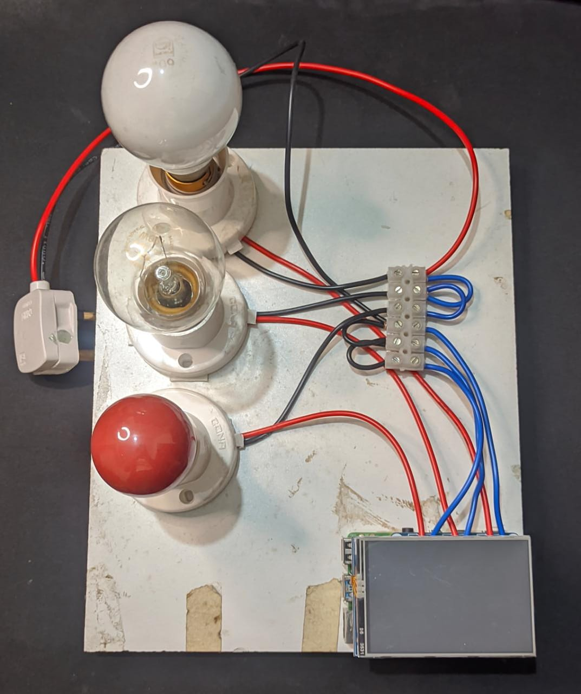
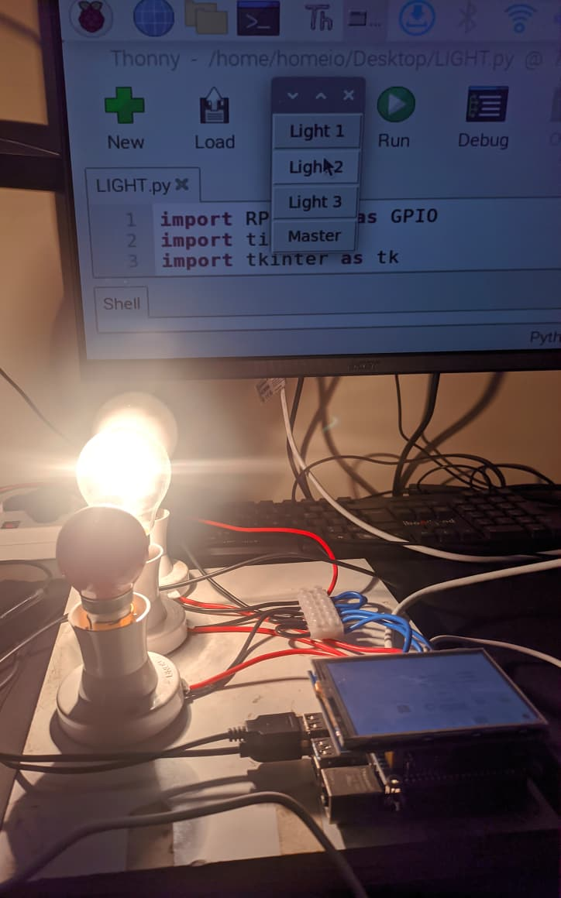

# 🏡 Homeio – Smart Home Automation System

> An IoT-powered smart home system built using **Raspberry Pi 4B**, Flask, and GPIO-based relay control to automate and control home appliances via smartphone and voice commands.  
> Developed as a **7th semester mini-project** at **Malnad College of Engineering**, this project combines low-cost hardware with practical innovation to bring smart living to life.

---

## 📌 Abstract

With rising energy consumption and the need for more sustainable homes, **Homeio** was developed to enable smart automation of appliances - even without internet access. The system leverages local wireless control via Flask, and is capable of switching appliances like light bulbs using relays triggered by Raspberry Pi GPIO pins. The goal is simple: provide cost-effective, easy-to-use smart home automation to Indian households using open-source tools and off-the-shelf components.

---

## 🎯 Objective

- Automate daily routines by controlling electrical devices remotely
- Offer users the ability to manage their homes from smartphones or computers
- Reduce manual effort, improve energy efficiency, and increase comfort
- Provide secure local network access for appliance control
- Use open technologies like Flask and Python on a Raspberry Pi to create a fully working, extendable prototype

---

## 🧠 Features

- 🔌 Control multiple light bulbs/appliances via GPIO relays  
- 📶 Local wireless access through a Flask-based web app  
- 📱 Minimal, user-friendly web interface with ON/OFF toggle switches  
- ⚡ Master switch to control all appliances at once  
- 🔒 Secure private network access - no internet required  
- 🧠 Compatible with smart bulbs and similar devices over the same LAN

---

## 🧰 Hardware Used

- **Raspberry Pi 4B** - Core microcontroller & server
- **Relay HAT (3-Channel)** - To switch appliances via GPIO
- **3.5” LCD Display** - For local visual output (optional)
- **Bayonet Holders & Light Bulbs** - Appliances for demo
- **Connectors, Power Supply & Cabling** - Wiring setup

---

## 💻 Software Used

- **Raspberry Pi OS (32-bit)**  
- **Python (via Thonny IDE)**  
- **Flask** - Lightweight Python web server  
- **LCDShow Drivers** – For 3.5” display control  
- **GPIO & Time Libraries** - For relay management  

---

## 🔁 Functional Capabilities

- Control appliances individually or in batch using the master switch
- Host Flask app over Wi-Fi and access via any browser-connected device
- Real-time response with <1s delay on appliance switching
- Works entirely offline within a local network (for security)
- Extendable to support additional devices and sensors

---

## 📸 Screenshots

### 🧩 Final Prototype Model  

### ⚙️ Working Model in Action  

---

## ⚙️ System Design

- Relays connected to GPIO pins 21, 26, and 20 (BCM mode)
- Relays drive appliances using bayonet holders connected to 230V mains
- Flask server hosts a web app UI with 4 switches and a master switch
- Code runs an infinite loop to listen for state changes and trigger relays
- Designed with safety in mind – only use with proper isolation and fuse protection!!
